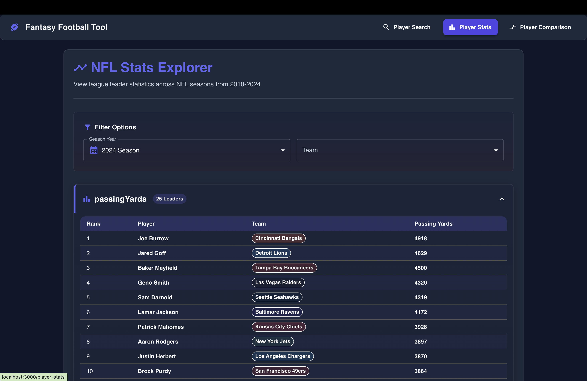
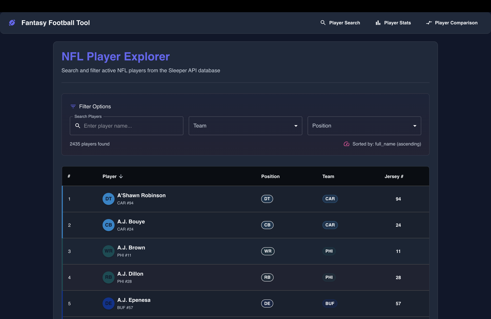
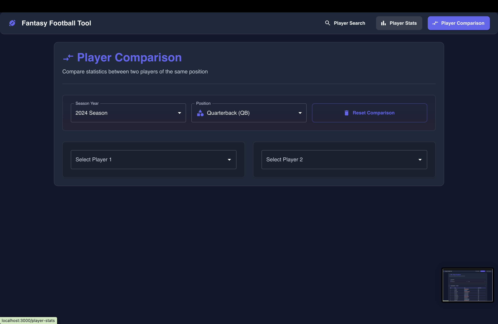

# Fantasy Football Stats Tool

A comprehensive web application that provides in-depth statistical analysis and visualization of NFL player performance data. Track league leaders across multiple statistical categories from 2010–2024 with an intuitive, responsive interface designed to help you dominate your fantasy football league.

## Key Features

- **Comprehensive Season Data:** Access player statistics from NFL seasons 2010–2025.
- **Dynamic Filtering:** Filter player stats by team and season.
- **Visual Category Segmentation:** Color-coded categories for quick identification.
- **Dual API Integration:** Combines data from the ESPN API and the Sleeper API for comprehensive coverage.
- **Responsive Design:** Optimized for both desktop and mobile viewing.

## 🔜 Coming Soon

- **Player Comparison Tool:** Side-by-side comparisons of player stats for optimal lineup decisions.
- **Draft Insights:** AI-powered recommendations for draft strategies based on historical performance.
- **Fantasy Point Projections:** Weekly and seasonal projections to help you win matchups.
- **Sleeper League Integration:** Connect directly to your Sleeper leagues for personalized insights.

## Screenshots

<p align="center">
  
  
  
</p>

## Installation

```bash
# Clone the repository
git clone https://github.com/Shreyas-Inampudi/fantasy-football-tool.git

# Navigate to the directory
cd fantasy-football-tool

# Install dependencies
npm install

# Start the development server
npm start
```
Then, open your browser and navigate to http://localhost:3000.

## Usage Guide
- **Select a Season:** Use the dropdown to choose an NFL season (2010–2024).
- **Filter by Team:** Optionally filter statistics by a specific NFL team.
- **Browse Categories:** Expand or collapse statistical categories (e.g., Passing, Rushing, Receiving).
- **View Leaders:** See league leaders ranked by performance in each statistical category.

## Data Sources
- **ESPN Sports API:** Provides official, real-time, and historical NFL statistics.
- **Sleeper API:** Offers league-specific data and fantasy-focused metrics for enhanced insights.

## Future Enhancements
- Advanced statistical filtering options.
- User tracking for favorite teams and players.
- Weekly matchup analyzer.
- Trade value calculator.
- Injury impact assessment.
- Multi-platform fantasy league integration.

## Contributing
- Contributions are welcome! 

**To contribute:**
- Fork the repository.

**Create your feature branch:**

```bash
git checkout -b feature/amazing-feature
```

**Commit your changes:**
```bash
git commit -m 'Add some amazing feature'
```

**Push to your branch:**
```bash
git push origin feature/amazing-feature
```
Open a Pull Request.

## Acknowledgements
- Data provided by the ESPN Sports API and the Sleeper API.
- NFL team names, logos, and statistics are the property of their respective owners.
- Made by Shreyas Inampudi
